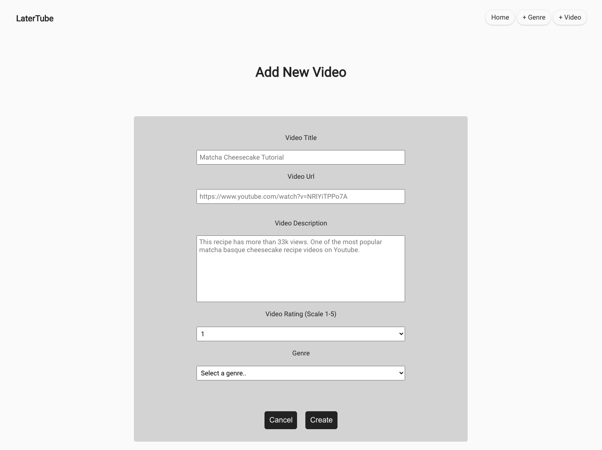

# LaterTube: A Youtube Bookmarker

Link to Live Demo: https://latertube-app.now.sh/


## What is LaterTube?

LaterTube stores Youtube videos you want to watch later. Come back anytime to the videos without distractions.


*Features*

- *Categorization:* Users can create their own video genre(video type) and store the videos under matching genres.


- *Personalization:* Users can rate the videos, re-name the videos and give brief introductions. This is a personalized watch-later playlist, free from any annoying and unwanted purchased ads and banners.



- *Watch in one-click:* Click on the "watch now" button and go directly to the Youtube.

## Technology Used
- React
- Node
- Express
- CSS
- PostgreSQL


## API Documentation
Clone this repo to your local machine:

    git clone https://github.com/tacoqqq/latertube-api.git

Base URL:

    https://quiet-scrubland-74517.herokuapp.com/api

### All Genres Endpoint: 

    /genres

Available Requests:
- GET

will return this data structure:
```
[
    {
        genre_id: 1,
        genre_title: 'Dessert Recipe',
        genre_created_time: 2020-05-30 18:21:36.491043+00
    },
    {
        genre_id: 2,
        genre_title: 'Javascript Tutorial',
        genre_created_time: 2020-05-30 18:21:36.491043+00
    }
    ...
    ...
]
```
- POST

need to provide data following this format:

```
    {
        genre_title: 'NAME YOUR GENRE TITLE',
    }
```

will return 

`/genres/3`

```
    {
        genre_id: 3,
        genre_title: 'NAME YOUR GENRE TITLE',
        genre_created_time: AUTO GENERATED TIME
    }
```

`genre_id` and `genre_created_time` are automatially generated by API.


### One Specific Genre Endpoint: 

    /genres/:genreId

Available Requests:
- GET

`/genres/1` will return this data structure:

```
    {
        genre_id: 1,
        genre_title: 'Dessert Recipe',
        genre_created_time: 2020-05-30 18:21:36.491043+00
    }
```

- DELETE

`/genres/1` will return status code 204

### All Videos Endpoint: 

    /videos

Available Requests:
- GET

will return this data structure:

```
    [
         {
             video_id: 1,
             video_title: 'Matcha Basque Cheese Cake Recipe',
             video_thumbnail_url: 'https://img.youtube.com/vi/NRlYiTPPo7A/maxresdefault.jpg',
             video_url: 'https://www.youtube.com/watch?v=NRlYiTPPo7A',
             video_description: 'One of the most popular matcha basque cheesecake recipe videos on Youtube.',
             video_rating: 5,
             genre_id: 1,
             video_created_time: 2020-05-30 18:21:36.491043+00
         },
         {
             video_id: 2,
             video_title: 'Easy flan / creme caramel',
             video_thumbnail_url: 'https://img.youtube.com/vi/tB55iAo3p2Y/maxresdefault.jpg',
             video_url: 'https://www.youtube.com/watch?v=tB55iAo3p2Y',
             video_description: 'Easy Flan/ creme caramel in three simple steps.',
             video_rating: 5,
             genre_id: 1,
             video_created_time: 2020-05-31 21:05:31.003453+00
         }
    ]
```

- POST

need to provide data following this format:

```
    {
        video_title: 'No Bake Oreo Cheesecake Bars',
        video_url: 'https://www.youtube.com/watch?v=RlYIlkZZMsM',
        video_description: 'These dense and creamy oreo cheesecake bars are incredibly delicious, made with a cookie base.',
        video_rating: 3,
        genre_id: 1,
    },
```

*All entries are required data except for `video_description`.


will return 

`/videos/3`

```
    {
        video_id: 3,
        video_title: 'No Bake Oreo Cheesecake Bars',
        video_thumbnail_url: 'https://img.youtube.com/vi/RlYIlkZZMsM/maxresdefault.jpg',
        video_url: 'https://www.youtube.com/watch?v=RlYIlkZZMsM',
        video_description: 'These dense and creamy oreo cheesecake bars are incredibly delicious, made with a cookie base.',
        video_rating: 3,
        genre_id: 1,
        video_created_time:  2020-06-01 21:05:31.003453+00
    },
```
`video_id`, `video_thumbnail_url` and `video_created_time` are automatially generated by API.

### One Specific Video Endpoint:

    /videos/:videoId

Available Requests:

- GET

`/videos/1` will return this data structure:

```
    {
        video_id: 1,
        video_title: 'Matcha Basque Cheese Cake Recipe',
        video_thumbnail_url: 'https://img.youtube.com/vi/NRlYiTPPo7A/maxresdefault.jpg',
        video_url: 'https://www.youtube.com/watch?v=NRlYiTPPo7A',
        video_description: 'This recipe has more than 33k views. One of the most popular matcha basque cheesecake recipe videos on Youtube.',
        video_rating: 5,
        genre_id: 1,
        video_created_time: new Date().toLocaleString()
    }
```

- PATCH

`/videos/1` need to provide data following this format:

```
    {
        video_title: 'UPDATED TITLE',
        video_url: 'UPDATED URL',
        video_description: 'UPDATED DESCRIPTION',
        video_rating: UPDATED NUMBER,
        genre_id: UPDATED NUMBER,
        video_created_time: UPDATED TIME
    },
```
*All entries are required data except for `video_description`.

will return 

`/videos/1`

```
    {
        video_id: 1,
        video_title: 'UPDATED TITLE',
        video_thumbnail_url: 'AUTO-GENERATED VIDEO THUMBNAIL URL',
        video_url: 'UPDATED URL',
        video_description: 'UPDATED DESCRIPTION',
        video_rating: UPDATED NUMBER,
        genre_id: UPDATED NUMBER,
        video_created_time: UPDATED TIME
    },
```
`video_thumbnail_url` is automatially generated by API.

- DELETE

`/videos/1` will return status code 204