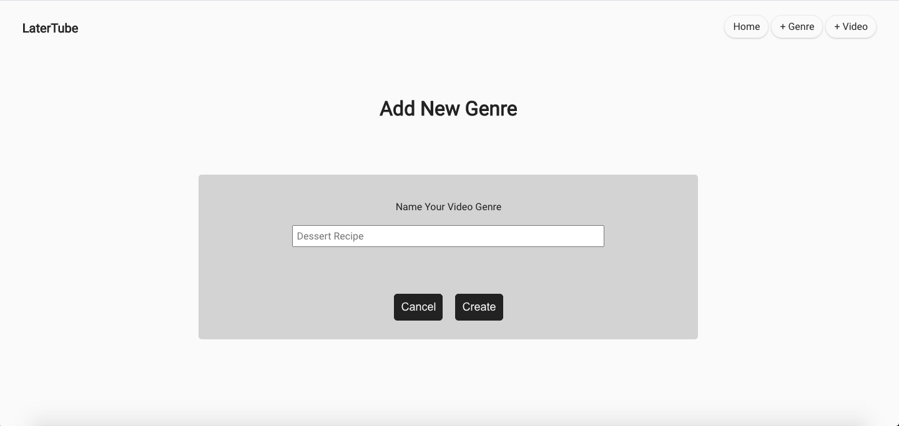

# LaterTube: A Youtube Bookmarker

Link to Live Demo: https://latertube-app.now.sh/

## What is LaterTube?

LaterTube stores Youtube videos you want to watch later. Come back anytime to the videos without distractions.
<b>Features</b>
<ul>
    <li>Categorization: Users can create their own video genre(video type) and store the videos under matching genres.</li>
    
    <li>Personalization: Users can rate the videos, re-name the videos and give brief introductions. This is a personalized watch-later playlist, free from any 
    annoying and unwanted purchased ads and banners.</li>
    
    <li>Watch in one-click: Click on the "watch now" button and go directly to the Youtube. </li>
</ul>

## Technology Used
<ul>
    <li>React</li>
    <li>Node</li>
    <li>Express</li>
    <li>CSS</li>
    <li>PostgreSQL</li>
</ul>

Documentation of your API.
Screenshot(s) of your app. This makes your app description much easier to understand.
